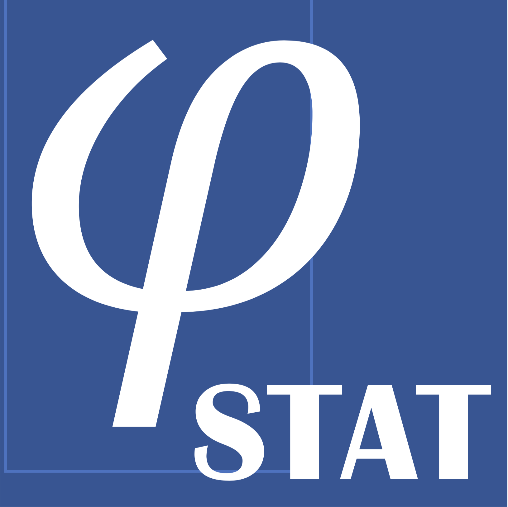

# INTRODUCTION

PHYSTAT is an event series dealing with statistical methods in particle physics. It was founded in 2000 by Louis Lyons.
A wide range of topics is covered: frequentist and Bayesian inference, parameter estimation, hypothesis testing,
Goodness of Fit testing, confidence interval estimation, unfolding, multivariate analysis techniques, systematic uncertainties,
data combination and more. The workshops provide a unique meeting point of Physicists and Statisticians,
where the latest advances in statistical techniques and procedures are exchanged. Most of the Workshops have recommended
reading material, plus links to material to give Statisticians the necessary background in Particle Physics.
The workshops’ timetables have ample time assigned for discussions.  The recordings of the workshops provide a
comprehensive reference on statistical issues and state of the art methods used in particle physics and neighbouring fields.
Since the beginning of 2018, Olaf Behnke (DESY) is the chairperson of PHYSTAT.  In 2019, he initiated the PHYSTAT Seminar series, 
which take place about once per month.

## PHYSTAT event organizer core team:
Louis Lyons (Imperial & Oxford), Lydia Brenner (Nikhef),  Nick Wardle (Imperial), Olaf Behnke (DESY) and Sara Algeri (UMN)

We are happy for your comments on the program including suggestions on topics and speakers of future events, please contact us by email to
[louis.lyons@physics.ox.ac.uk](mailto:louis.lyons@physics.ox.ac.uk), [lbrenner@nikhef.nl](mailto:lbrenner@nikhef.nl),[nw709@ic.ac.uk](mailto:nw709@ic.ac.uk), [olaf.behnke@desy.de](mailto:olaf.behnke@desy.de), [salgeri@umn.edu](mailto:salgeri@umn.edu)
or via phone:
Louis Lyons: +442075947804; Lydia Brenner: +31205922009; Nicholas Wardle: +442075943419; Olaf Behnke: +494089983854 


## Upcoming and past Events:
Please take note that you can also [subscribe here](https://e-groups.cern.ch/e-groups/EgroupsSubscription.do?egroupName=phystat-events) to our PHYSTAT Event news email list
(this requires a CERN computing account, if you don't have one you can easily register for a CERN lightweight at [this webpage](https://account.cern.ch/account/Externals/RegisterAccount.aspx))

**The PHYSTAT EVENTS Indico Page is [here](https://indico.cern.ch/category/10790/)**

Subscribe to the google calendar below to make sure you never miss an upcoming event! 

```
8fun2qd3u76njptm4vujonscqo8a29iv@import.calendar.google.com
```

## PHYSTAT advisory Committee (2023):

   * Olaf Behnke (DESY) [Chair] [olaf.behnke@desy.de](mailto:olaf.behnke@desy.de)
   * Louis Lyons (Imperial) [louis.lyons@physics.ox.ac.uk](mailto:louis.lyons@physics.ox.ac.uk)
   * Sara Algeri (Minnesota) [salgeri@umn.edu](mailto:salgeri@umn.edu)
   * Lydia Brenner (Nikhef) [lydia.brenner@cern.ch](mailto:lydia.brenner@cern.ch)
   * Robert Cousins (UCLA) [cousins@physics.ucla.edu](mailto:cousins@physics.ucla.edu)
   * Glen Cowan (RHUL) [g.cowan@rhul.ac.uk](mailto:g.cowan@rhul.ac.uk)
   * Kyle Cranmer (NYU)  [kyle.cranmer@cern.ch](mailto:kyle.cranmer@cern.ch)
   * David van Dyk (Imperial) [d.van-dyk@imperial.ac.uk](mailto:d.van-dyk@imperial.ac.uk)
   * Thomas R. Junk (FNAL) [trj@fnal.gov](mailto:trj@fnal.gov)
   * Mikael Kuusela (CMU) [mikael.kuusela@cern.ch](mailto:mikael.kuusela@cern.ch)
   * Richard Lockhart (Simon Fraser) [lockhart@sfu.ca](mailto:lockhart@sfu.ca)
   * Ben Nachman (Berkeley) [bpnachman@lbl.gov](mailto:bpnachman@lbl.gov)
   * Nicholas Wardle (Imperial) [nw709@ic.ac.uk](mailto:nw709@ic.ac.uk)
   * Sarah Williams (Cambridge) [sarah.louise.williams@cern.ch](mailto:sarah.louise.williams@cern.ch)
